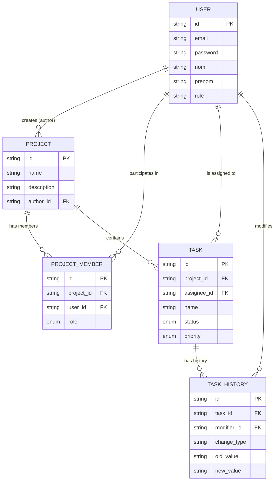

# Dictionnaire de Données

Ce document décrit la structure de la base de données pour le projet PMT.

## Table: `user`
Représente les utilisateurs de l'application.

| Colonne | Type | Contraintes | Description |
| :--- | :--- | :--- | :--- |
| `id` | `CHAR(36)` | PK, NOT NULL | Identifiant unique (UUID). |
| `email` | `VARCHAR` | UNIQUE, NOT NULL | Adresse email de connexion. |
| `password` | `VARCHAR` | NOT NULL | Mot de passe hashé (BCrypt). |
| `nom` | `VARCHAR` | NOT NULL | Nom de famille. |
| `prenom` | `VARCHAR` | NOT NULL | Prénom. |
| `role` | `VARCHAR` | NOT NULL | Rôle global (ex: USER, ADMIN - à ne pas confondre avec ProjectRole). |

## Table: `project`
Représente un projet géré dans l'outil.

| Colonne | Type | Contraintes | Description |
| :--- | :--- | :--- | :--- |
| `id` | `CHAR(36)` | PK, NOT NULL | Identifiant unique (UUID). |
| `name` | `VARCHAR(100)` | NOT NULL | Nom du projet. |
| `description` | `TEXT` | | Description détaillée du projet. |
| `author_id` | `CHAR(36)` | FK -> `user.id`, NOT NULL | Créateur/Propriétaire du projet. |
| `created_at` | `TIMESTAMP` | NOT NULL | Date de création automatique. |

## Table: `project_member`
Table de jointure pour associer des utilisateurs aux projets avec un rôle spécifique.

| Colonne | Type | Contraintes | Description |
| :--- | :--- | :--- | :--- |
| `id` | `CHAR(36)` | PK, NOT NULL | Identifiant unique (UUID). |
| `project_id` | `CHAR(36)` | FK -> `project.id`, NOT NULL | Le projet concerné. |
| `user_id` | `CHAR(36)` | FK -> `user.id`, NOT NULL | L'utilisateur membre. |
| `role` | `VARCHAR` | ENUM ('ADMIN', 'MEMBER', 'OBSERVER'), NOT NULL | Rôle de l'utilisateur dans ce projet. |
| **Index** | | UNIQUE (`project_id`, `user_id`) | Un utilisateur ne peut avoir qu'un seul rôle par projet. |

## Table: `task`
Représente une tâche à réaliser dans un projet.

| Colonne | Type | Contraintes | Description |
| :--- | :--- | :--- | :--- |
| `id` | `CHAR(36)` | PK, NOT NULL | Identifiant unique (UUID). |
| `project_id` | `CHAR(36)` | FK -> `project.id`, NOT NULL | Projet auquel appartient la tâche. |
| `assignee_id` | `CHAR(36)` | FK -> `user.id`, NOT NULL | Utilisateur assigné à la tâche. |
| `name` | `VARCHAR(100)` | NOT NULL | Titre de la tâche. |
| `description` | `TEXT` | | Description détaillée. |
| `status` | `VARCHAR` | ENUM ('TODO', 'IN_PROGRESS', 'DONE', 'ARCHIVED'), NOT NULL | Statut d'avancement. |
| `priority` | `VARCHAR` | ENUM ('LOW', 'MEDIUM', 'HIGH', 'CRITICAL'), NOT NULL | Niveau de priorité. |
| `due_date` | `DATE` | | Date limite de réalisation. |
| `completion_date` | `DATE` | | Date réelle de fin. |
| `created_at` | `TIMESTAMP` | NOT NULL | Date de création. |

## Table: `task_history`
Historique des modifications apportées aux tâches (Audit Log).

| Colonne | Type | Contraintes | Description |
| :--- | :--- | :--- | :--- |
| `id` | `CHAR(36)` | PK, NOT NULL | Identifiant unique (UUID). |
| `task_id` | `CHAR(36)` | FK -> `task.id`, NOT NULL | La tâche modifiée. |
| `modifier_id` | `CHAR(36)` | FK -> `user.id`, NOT NULL | L'utilisateur ayant effectué la modification. |
| `change_type` | `VARCHAR(50)` | NOT NULL | Type de changement (ex: 'STATUS_UPDATE', 'ASSIGNMENT'). |
| `old_value` | `TEXT` | | Valeur avant modification (JSON ou String). |
| `new_value` | `TEXT` | | Valeur après modification. |
| `modified_at` | `TIMESTAMP` | NOT NULL | Date de la modification. |

## Schéma Relationnel (Diagramme ER)

Copiez ce bloc de code dans un bloc `Mermaid` sur Notion pour visualiser le diagramme.

## Relations & Cardinalités

Voici le détail technique des relations entre les entités :

#### 1. User <-> Project
*   **Type** : `1:N` (Un-à-Plusieurs)
*   **Description** : Un utilisateur peut créer plusieurs projets (`author_id`), mais un projet n'a qu'un seul auteur.

#### 2. Project <-> ProjectMember <-> User
*   **Type** : `M:N` (Plusieurs-à-Plusieurs) via table de jointure.
*   **Description** : Un projet a plusieurs membres, et un utilisateur peut être membre de plusieurs projets.
*   **Cardinalité** :
    *   `Project` 1 -- * `ProjectMember`
    *   `User` 1 -- * `ProjectMember`

#### 3. Project <-> Task
*   **Type** : `1:N` (Un-à-Plusieurs)
*   **Description** : Un projet contient plusieurs tâches. Une tâche appartient obligatoirement à un seul projet.
*   **Suppression en cascade** : Souvent, supprimer un projet supprime ses tâches (à configurer selon besoins métier).

#### 4. User <-> Task (Assignation)
*   **Type** : `1:N` (Un-à-Plusieurs)
*   **Description** : Un utilisateur peut se voir assigner plusieurs tâches. Une tâche est assignée à un seul utilisateur principal (dans ce modèle simple).

#### 5. Task <-> TaskHistory
*   **Type** : `1:N` (Un-à-Plusieurs)
*   **Description** : Une tâche peut avoir plusieurs entrées d'historique. Chaque entrée correspond à un événement de modification.
